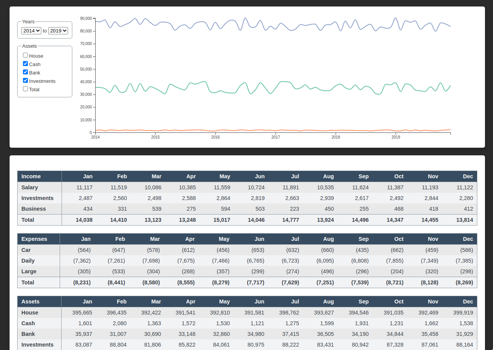

<p align="center">
  
</p>
<hr>
<h1 align="center">Dough</h1>
<h4 align="center">Visualize and track your finances.</h4>

Dough is a full stack TypeScript and D3.js app that shows you how your income, expenses and assets have changed over time.

It includes an interactive graph and table that help you summarize your current financial status.

### Getting Started

In order to enhance privacy and enable offline usage, Dough reads data from a local `data.json` file.

The first step in loading the app is to create this data source:

```txt
1. Create a `data` directory in the project root.
2. Place a `data.json` file in the newly created directory.
```

### Data Format

Your `data.json` file should have the following format:

```json
"year": {
    "month": {
      "assets": {},
      "expenses": {},
      "income": {}
    },
}
```

For Example, for the first three months of 2021, data would be:

```json
{
  "2021": {
    "01": {
      "assets": {
        "cash": 1000,
        "house": 1000,
        "investments": 1000
      },
      "expenses": {
        "daily": -1000,
        "oneOff": -200
      },
      "income": {
        "salary": 1000,
        "other": 0
      }
    },
    "02": {
      "assets": {
        "cash": 1000,
        "house": 1000,
        "investments": 1000
      },
      "expenses": {
        "daily": -1000,
        "oneOff": -200
      },
      "income": {
        "salary": 1000,
        "other": 0
      }
    },
    "03": {
      "assets": {
        "cash": 1000,
        "house": 1000,
        "investments": 1000
      },
      "expenses": {
        "daily": -1000,
        "oneOff": -200
      },
      "income": {
        "salary": 1000,
        "other": 0
      }
    }
}
```
